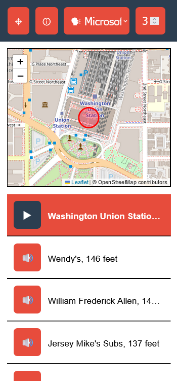
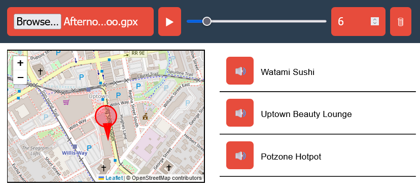

# Soundscape Web Client

The Soundscape web client provides a Soundscape-like experience by announcing nearby points of interest and intersections and playing audio beacons, all with spatial audio.

Try it for yourself! https://soundscape-community.github.io/soundscape-web-client/



This project aims to make both the user and developer communities for Soundscape more inclusive:
1. Unlike the original iPhone app, users do not need an iOS device. By running in a browser, the Soundscape web client works on any platform. You can use it not just on iPhone, but also Android, and even Windows.
2. Developers do not need a Mac or comfort with Xcode to contribute. Web technologies are approachable and  familiar to many developers who are interested in improving the software.

## Contributing

Help is welcome! Please see the [issue board](https://github.com/soundscape-community/soundscape-web-client/issues) for items that need attention, and below for some tools to aid in development and debugging.

### Activity simulator



Select a local GPX file from your computer, and it will be replayed on a visual map with audio callouts.

https://soundscape-community.github.io/soundscape-web-client/?mode=gpx

### Location override
To use a location other than what's reported by your device, include the latitude, longitude, and compass heading (degrees from north) in the URL, e.g. https://soundscape-community.github.io/soundscape-web-client/?lon=-77.006156&lat=38.897600&heading=0.0 will place you near Union Station in Washington, D.C.

### Running the app on your own machine
1. Install dependencies, build the app, and start the server
    ```
    npm ci && npm run build && npm run serve-tiles
    ```
    The app should now be running and accessible over HTTP from a web browser at http://127.0.0.1:8080/

2. For the app to work properly from your phone, you'll need to serve it over HTTPS. The easiest way to do this is via a tunnel, such as:
    1. ngrok: `ngrok http http://127.0.0.1:8080/`
    2. [Microsoft Dev Tunnels](https://learn.microsoft.com/en-us/azure/developer/dev-tunnels/overview): `devtunnel host -p 8080`
    3. Many other [tunneling options](https://github.com/anderspitman/awesome-tunneling?tab=readme-ov-file)

### Running the Android version
1. Build and sync the app
    ```
    npm ci && npm run build && npx cap sync
    ```
2. Open it in Android studio and run it from there
    ```
    npx cap open android
    ```
    From Android studio you can run it either in an emulator or on a real device.

### Update Splash Screens and Icons Android
Just place your images as decrived in in `\assets` https://capacitorjs.com/docs/guides/splash-screens-and-icons and run `npx capacitor-assets generate --android`

## Third-party libraries used
1. [Turf.js](https://turfjs.org/) (for GeoJSON processingand geospatial calculations)
2. [Leaflet](https://leafletjs.com/) (provides OpenStreetMap widget)
3. [unmute](https://github.com/swevans/unmute) (improved web audio behavior on iOS)
